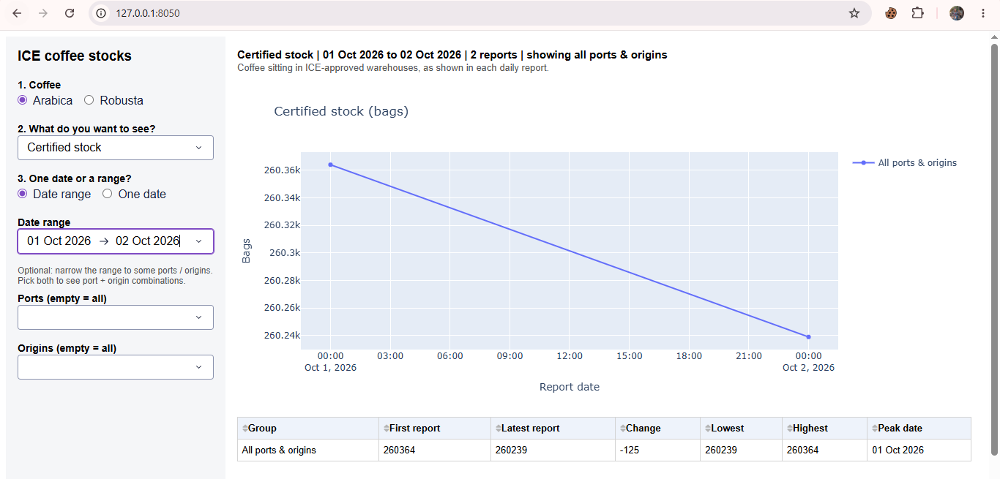
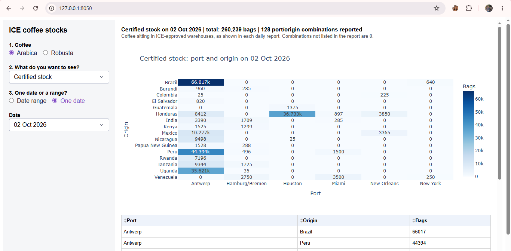
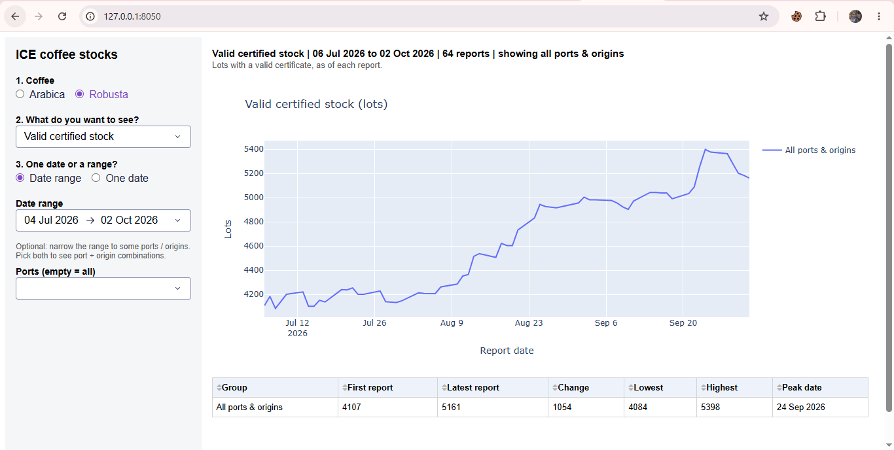

# Dashboard – `dashboard.py`

## 1. Purpose

`dashboard.py` creates an interactive **Dash + Plotly dashboard** for exploring the final:

`ice_certified_coffee_stocks.csv`

It allows the user to select:

- Coffee type – Arabica or Robusta
- Stock category
- One date or a date range
- Optional port
- Optional origin

The dashboard then updates the chart, summary values, and table based on the selections.

---

## 2. How to Run

Install the required packages:

```bash
pip install dash plotly pandas
```

Run using the default CSV:

```bash
python dashboard.py
```

By default, the dashboard uses:

```text
ice_certified_coffee_stocks.csv
```

To use another CSV or port:

```bash
python dashboard.py --csv other.csv --port 8060
```

The dashboard runs locally. Open the address shown in the terminal, normally:

```text
http://127.0.0.1:8050
```

---

## 3. Dashboard Controls

### Coffee

Select:

- Arabica
- Robusta

When the coffee type changes, the available categories, ports, origins, and dates are automatically updated for that coffee.

### Stock Category

The available categories depend on the selected coffee.

For example, Arabica contains:

- Certified stock
- Grading passed
- Grading failed
- Grading pending
- Flagged for rebagging

Robusta contains:

- Valid certified stock
- Non-tenderable
- Suspended

The dashboard uses readable descriptions for these categories.

### Date Selection

Two modes are available:

**Date range**

Shows the selected category across multiple ICE report dates.

**One date**

Shows the selected category for a single ICE report date, broken down by port and origin where available.

### Port and Origin

These are optional filters for date-range analysis.

- No selection → all ports/origins
- Port selected → selected port(s)
- Origin selected → selected origin(s)
- Both selected → selected port + origin combinations

---

## 4. What the Dashboard Shows

### One Date

For a single date, the dashboard shows:

- Total quantity reported
- Number of port/origin combinations
- A table of reported combinations
- A visual breakdown by port and origin

For Arabica, the chart is a **port × origin heatmap**.

For Robusta, origin is not reported, so the dashboard shows **port-level bars**.

If a date has no ICE report, the dashboard does not treat it as zero. It shows the nearest available report dates instead.

---

### Date Range

For a date range, the dashboard shows the selected category over all actual ICE report dates.

For **stock-level categories** such as certified stock, the chart is a line chart and the summary shows:

- First report
- Latest report
- Change
- Lowest value
- Highest value
- Peak date

For **flow categories** such as `grading_passed` and `grading_failed`, the chart is a bar chart and the summary shows:

- Total in range
- Average per report
- Highest day
- Peak date

This difference is important because grading passed/failed represent activity reported for a day, while categories such as certified stock represent stock levels.

---

## 5. Important Data Rules

The dashboard follows the meaning of the source data:

- A combination not listed in a report is treated as **0**.
- Days without an ICE report are **not treated as zero**; they remain gaps.
- Stock categories are **not added together**, because they do not all represent the same type of measurement.
- Robusta has no origin information, so the origin filter is hidden for Robusta.

---


### 1 – Main dashboard



> **Dashboard overview – interactive filters and selected coffee-stock category.**

### 2 – Single-date view



> **Single-date view – stock quantity by port and origin.**

###  – Date-range view


> **Date-range view – category trend and summary statistics across ICE report dates.**


---

## 7. In Simple Words

`dashboard.py` takes the final validated CSV and turns it into an interactive dashboard.

The user selects **what coffee, what category, and what dates they want to investigate**, and the dashboard automatically displays the relevant totals, trends, breakdowns, and detailed records.